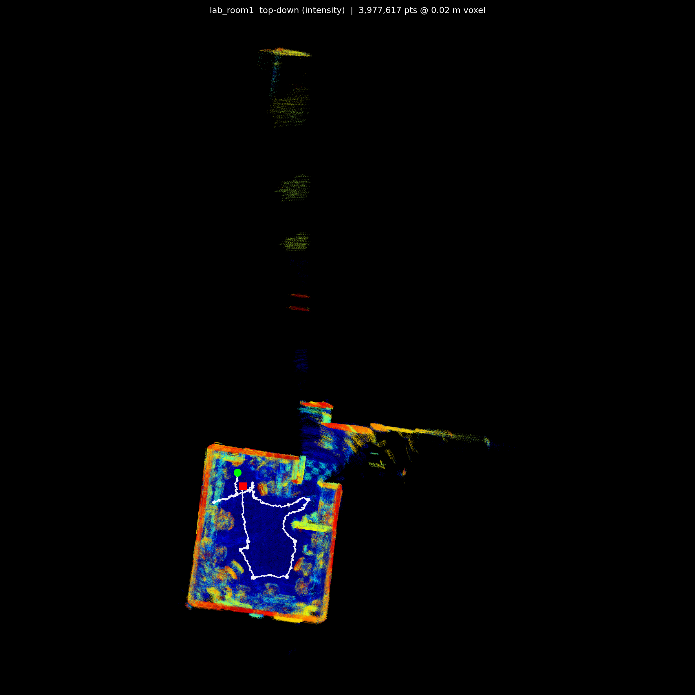
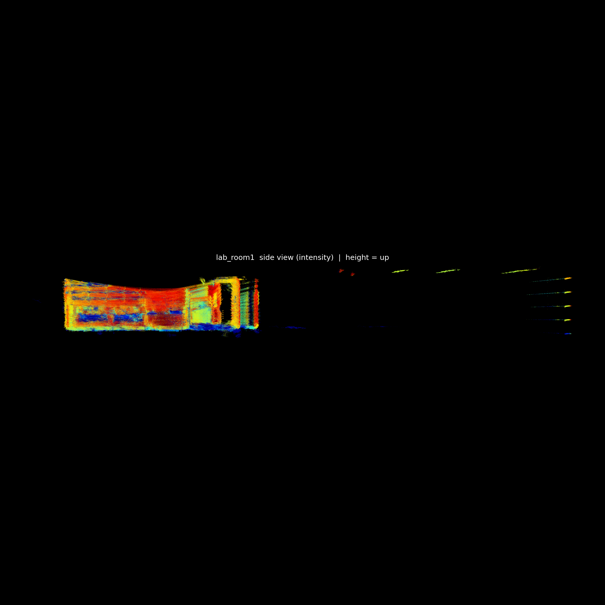

# ml_lidar — LiDAR Mapping & 3D ML on Intel NUC 14 Pro

Real-time 3D LiDAR mapping and machine-learning experiments on an Intel
Core Ultra 7 (Meteor Lake) NUC, using a **RoboSense Helios 16P** spinning
LiDAR with **ROS 2 Jazzy**. This is a monorepo — each numbered folder under
[`projects/`](projects/) is a self-contained project.

> Operational docs that contain local network/connection details are kept
> out of this repo by design.

---

## Hardware

| Component | Detail |
|---|---|
| Compute | Intel NUC 14 Pro — Core Ultra 7 165H (Meteor Lake), Arc iGPU, AI Boost NPU, 64 GB |
| LiDAR | RoboSense Helios 16P — 16 beams, 10 Hz, ~28,800 pts/frame, MSOP/DIFOP over Ethernet |
| Camera | Intel RealSense D455 — RGB + stereo depth + BMI055 IMU (USB 3.2) |
| OS / Middleware | Ubuntu 24.04, ROS 2 Jazzy |

The LiDAR publishes `/rslidar_points` (`sensor_msgs/PointCloud2`, fields
`x, y, z, intensity`) at 10 Hz.

---

## Projects

### [`01_kiss_icp_mapping`](projects/01_kiss_icp_mapping) — LiDAR-only 3D mapping
LiDAR odometry + mapping with [KISS-ICP](https://github.com/PRBonn/kiss-icp).
The robot drives an area; we record the raw scans + odometry, then rebuild a
dense, intensity-colored 3D map **offline** and export an ML-ready dataset
(per-frame point clouds paired with poses).

**First map — a lab room** (`lab_room1`): 260 s drive, 71.8 M raw points,
73.3 m trajectory, 0.69 m loop-closure error.

| Top-down (intensity) | Side view (intensity) |
|---|---|
|  |  |

▶ **Interactive 3D:** download
[`showcase/map_interactive.html`](projects/01_kiss_icp_mapping/showcase/map_interactive.html)
and open it in any browser to orbit / zoom / inspect the cloud.

In the top-down view the room reads as a rectangle (warm = high-reflectivity
walls, cool = floor) with the white robot path looped inside; the streak is the
LiDAR seeing out the doorway. In the side view you can count the 16 individual
laser beams fanning down the hall — a good reminder of why driving *through* a
space (close-range, overlapping passes) yields a denser map than staring down it.

---

## Pipeline (project 01)

Architecture is deliberately **decoupled** so a crashed viewer or a stray
Ctrl-C can never kill the sensor or the recording:

```
LiDAR driver ──> /rslidar_points ──> KISS-ICP ──> /kiss/odometry, /tf
                      │                                 │
                      └──────── rosbag record ──────────┘   (raw + poses only)
                                      │
                                  (offline)
                      export_dataset.py        render_map.py
                      → frames/*.npy            → dense intensity map.ply
                      → poses_tum.txt           → top/side PNGs
                      → map.ply, meta.json      → interactive HTML
```

Why record raw + odometry only: the maps/datasets are fully reproducible
offline, so a single recording can be re-exported or re-rendered any number of
ways (different voxel size, coloring, density) **without re-driving**.

Typical run:

```bash
# data engine (driver + KISS-ICP) is launched separately
bash projects/01_kiss_icp_mapping/run/record_run.sh <name>   # drive, then Ctrl-C
bash projects/01_kiss_icp_mapping/run/export_run.sh <name>    # -> ML dataset
bash projects/01_kiss_icp_mapping/run/render_run.sh <name>    # -> dense map + views
```

See [`projects/01_kiss_icp_mapping/FINDINGS.md`](projects/01_kiss_icp_mapping/FINDINGS.md)
for the full problem→fix log and run history.

---

## ML dataset format (per run)

```
<name>_dataset/
├── frames/000000.npy ...   # per LiDAR frame, (N,5): x, y, z, intensity, ring  (sensor frame)
├── poses_tum.txt           # robot pose per frame — TUM: t x y z qx qy qz qw
├── timestamps.txt          # per-frame timestamp
├── map.ply                 # merged world map (voxel-downsampled)
└── meta.json               # counts, fields, extents, voxel size
```

Every scan is paired with where the robot was — ready for tasks like
ground/obstacle segmentation, moving-object detection, scan→pose learning,
and place recognition.

*Bags and datasets are not committed (size); they are regenerated locally.*
